<picture>
  <source media="(prefers-color-scheme: dark)" srcset="./dark.svg">
  <source media="(prefers-color-scheme: light)" srcset="./light.svg">
  
</picture>

 

---

### 🛠️ Tech Stack

---

### 🔗 Connect With Me

---
### ✍️ Random Dev Quote

---
### 📊 GitHub Stats

 

